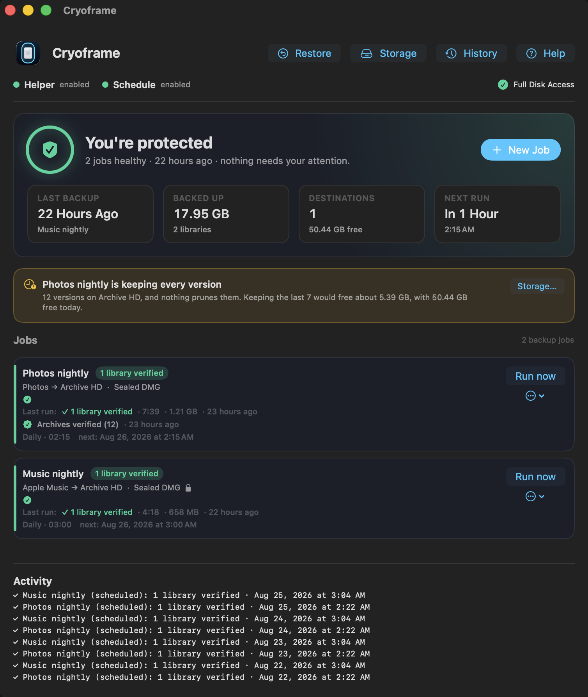
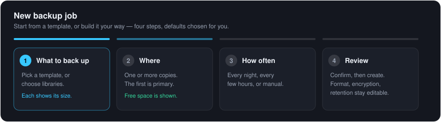
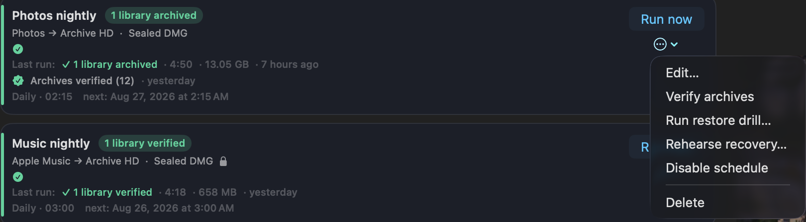
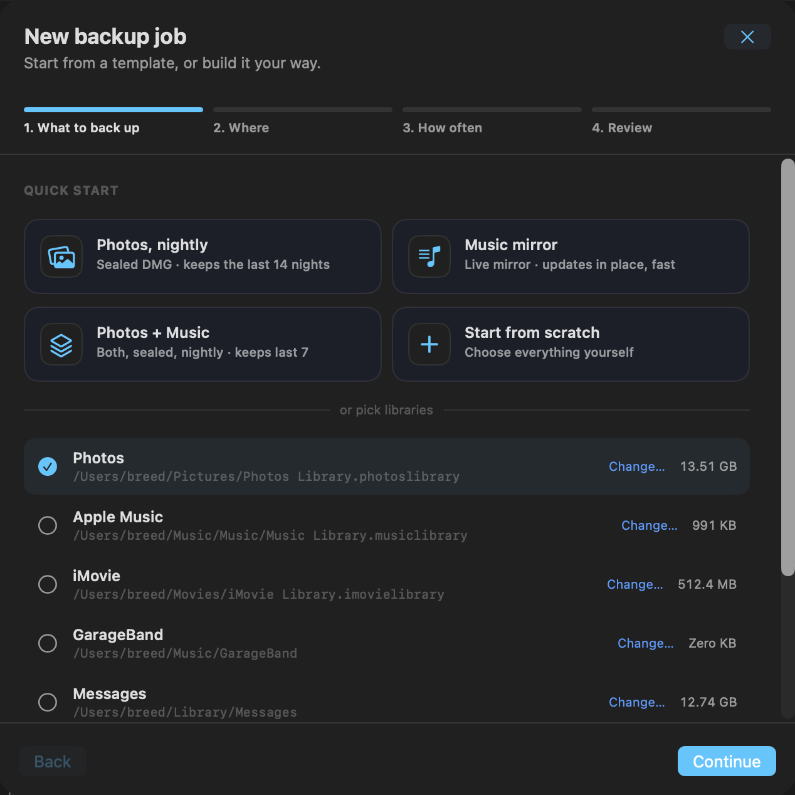
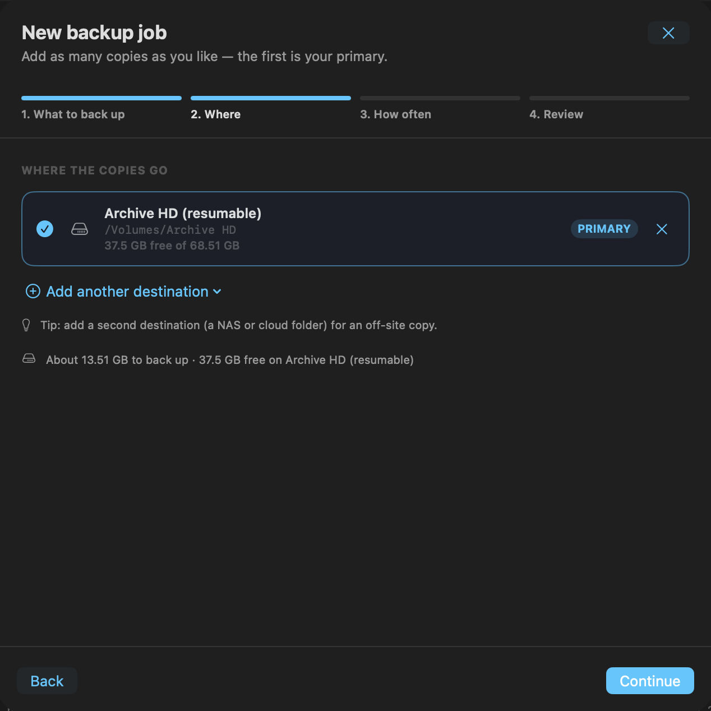
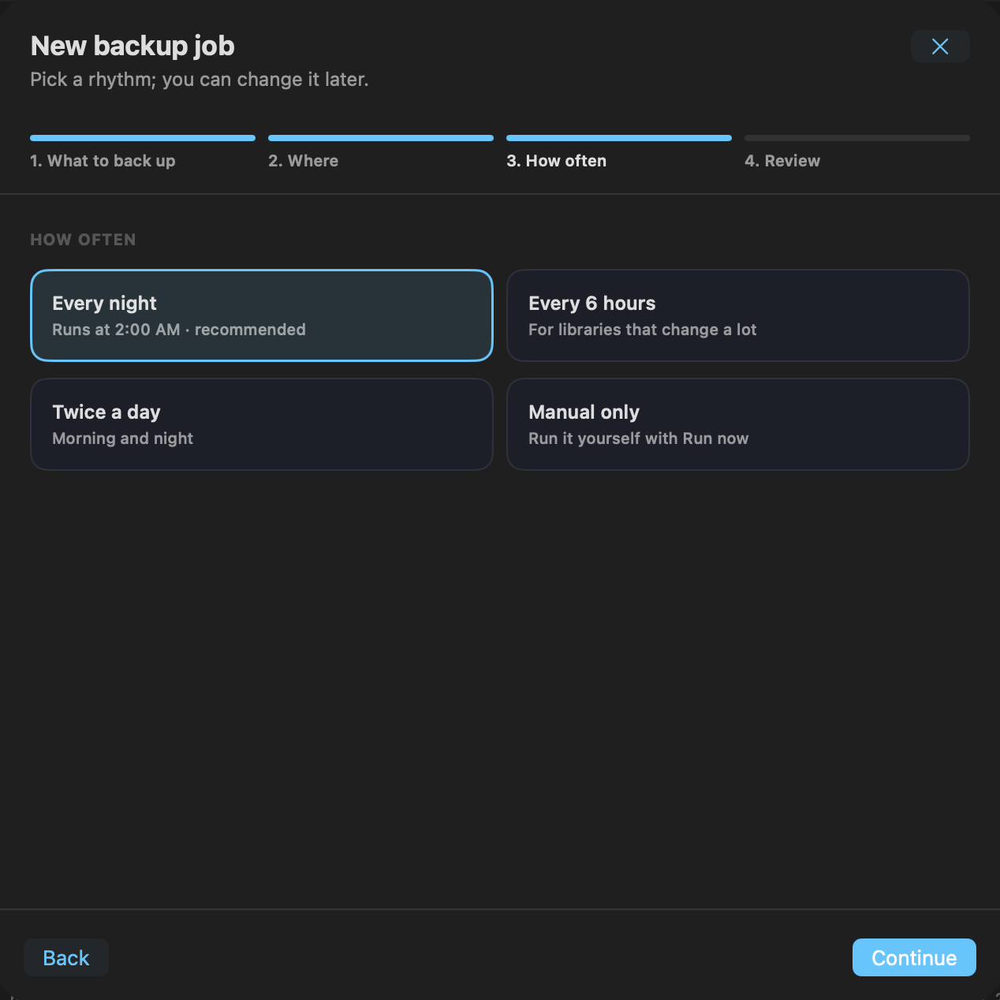
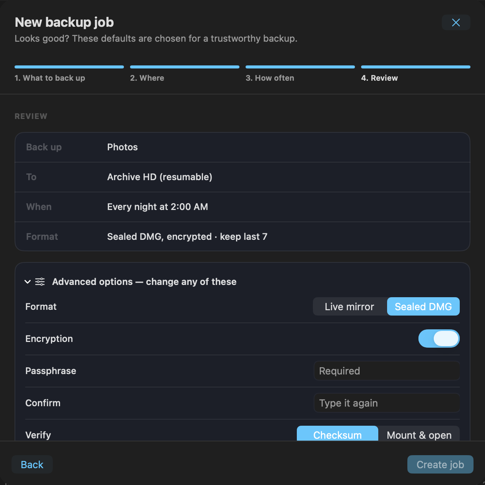
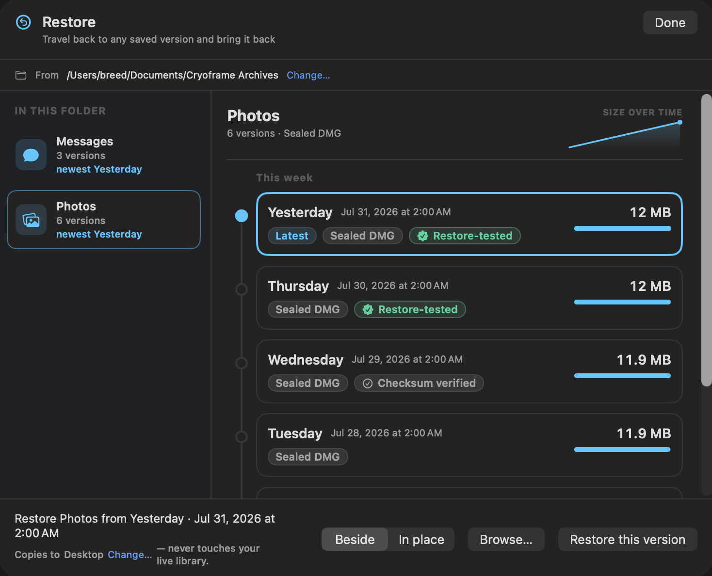
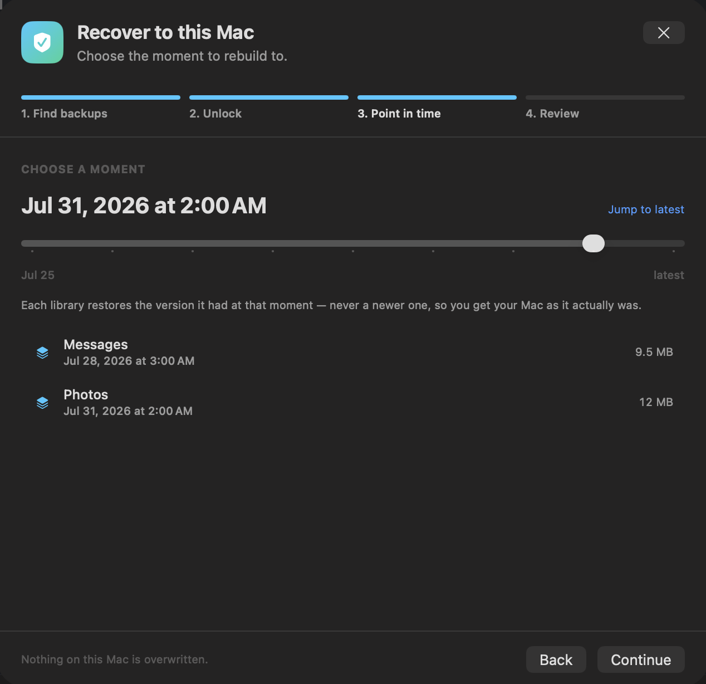

# Cryoframe

Back up live macOS media libraries into sealed, verifiable archives, on a schedule, without quitting the app that owns the library.

macOS 15+ · Apple Silicon · MIT licensed

📖 **[User guide](docs/guide/README.md)** — install, jobs, formats, encryption, restoring, and troubleshooting.

<p align="center">
  
</p>

<p align="center">
  
</p>

---

## The problem it solves

The hard part of backing up a media library is not the copy. It is taking a consistent point-in-time copy of a library whose database is being written to while the backup runs. If you zip a `.photoslibrary` while Photos has its database open, you can seal a half-written, corrupt database into the archive. The backup looks fine until the day you need it.

Cryoframe avoids that with APFS snapshots. For each run it freezes the volume, mounts the snapshot read-only, archives the library from that frozen copy, then deletes the snapshot. The library stays open the whole time, and the archive is a consistent moment in time.

It also verifies. Every archive gets a checksum manifest, and the strong mode mounts the finished archive and runs a database integrity check, so you find out a backup is bad now instead of during a restore.

## Features

- A protection dashboard at the top of the window: whether everything is backed up, the last successful run, total size protected, and free space on the destination. The job list comes below it. It also names any library on this Mac that no job covers, so a gap you forgot about does not stay invisible.
- Guided setup — templates for common backups (Photos nightly, Music mirror) or a step-by-step wizard, and you can drag a folder onto the window to start a job. Each library shows its size and each destination its free space, so you can tell a backup will fit before you create it.
- Consistent snapshots of live libraries using APFS, created and torn down per run.
- Libraries on any disk. A Photos or Music library kept on an external SSD is backed up from a snapshot of the drive it actually lives on, and a job spanning two drives still captures a single moment. Drives that can't be snapshotted (exFAT, HFS+) are read directly instead, and the run won't start while that library's app is open, since a closed app is what makes reading it live safe.
- Several libraries per job, archived from one snapshot into their own subfolders, so a job captures a consistent set in a single pass.
- Several destinations per job (the 3-2-1 rule): a local drive plus a NAS plus a cloud-sync folder, all from the same snapshot. Sealed archives are compressed once and copied to each. The primary must be reached; a downed secondary finishes the run as a partial backup instead of failing it.
- Three output formats: an incremental sparsebundle mirror that only rewrites the bands that changed (the default), or a sealed zip or DMG: immutable, checksummed, split into volumes when the target caps file size.
- Resumable transfers to network shares and external drives: the archive ships in part files and picks up from the last whole part after a dropped connection or unplugged drive.
- Restore built in: find an archive, verify it, and copy the library back out with its original folder name — beside the live one, or in place over it (staged and verified first, with the old copy moved to the Trash). Browse inside an archive and extract just the files you need.
- A restore timeline for versioned libraries: browse a library's nights, see how its size moved, and bring back the one you want. Versions that passed a restore drill are marked as restore-tested, and ones only checked by checksum say so instead. A version nothing has checked makes no claim at all.
- Guided recovery for a new Mac: point it at your backups, unlock the encrypted ones with your recovery-key file, pick a moment, and every library comes back as it was then. It never restores a version written after the moment you chose, so you get the Mac you had rather than a mix of days.
- Optional AES-256 encryption for sealed-DMG and live-mirror archives, with the passphrase kept in the Keychain so scheduled runs encrypt without prompting.
- Versioned sealed archives with a retention policy — the last N (seven by default), a daily/weekly/monthly scheme, or keep everything if you'd rather. Bounded by default, so a job can't quietly grow until the destination is full.
- Verification built in: a checksum manifest on every archive, plus an optional mount-and-open check that confirms the library's database opens clean.
- Archive health monitoring: re-hash existing archives against their manifests on demand or on a weekly/monthly schedule, to catch bit rot before a restore needs them. Works on encrypted archives with no passphrase.
- Restore drills: a deeper check that reassembles, mounts or extracts, and reopens each archive (a database integrity check), proving the restore path itself works, which matching bytes alone cannot.
- Recovery rehearsals: monthly, Cryoframe looks at a destination the way a recovery would — scanning what is actually there rather than the paths a job computes — and reports what would come back. A library a job claims to protect but that a restore would not find is named, which no per-archive check can tell you.
- Remote alerts over ntfy or a webhook (Slack/Discord/custom), sent by the scheduled runner itself, so an unattended Mac whose backups are failing reaches your phone whether or not the app is open. A destination running out of room is sent the same way, before the run that would fail.
- Recovery-key escrow: export every archive passphrase into one master-password-encrypted file (PBKDF2 + AES-GCM), so encrypted backups survive a lost Mac.
- Storage overview: per-job, per-version sizes against the free space on each destination volume.
- In-app updates over an Ed25519-signed appcast, and a first-run walkthrough for the helper and Full Disk Access.
- Targets for local disks, network shares, and cloud-sync folders, each with its own size cap and an availability preflight so a run never starts against an unmounted drive. There's no default destination to accept without thinking, and choosing one that shares a disk with what you're backing up says so.
- Cloud-sync aware: detects OneDrive/Dropbox/Google Drive/Box/iCloud folders, splits sealed archives under the plan's single-file limit, and skips offloaded (placeholder) archives during scheduled checks instead of silently re-downloading them.
- Run jobs concurrently up to a configurable limit, with live progress — speed, time elapsed, and time remaining — and pause, resume, or stop a run in flight.
- Durable run history: every run, manual or scheduled, is recorded with its outcome, per-library detail, duration, size, and any error, and survives quitting the app.
- Scheduling through a launchd agent, with per-job control over what happens if the owning app is open. A run missed while the Mac was asleep or off happens at the next check rather than waiting a whole cycle, and an unattended run holds off while the Mac is on battery and low on charge.
- Keeps the Mac awake while a backup runs, and can optionally wake it for a scheduled run, so unattended backups actually finish.
- A menu-bar status item and notifications, so you know at a glance whether the last run — including scheduled ones — succeeded.
- Owns its snapshots end to end. It never touches Time Machine's snapshots.

<div align="center">
  
</div>

## Supported libraries

Built in (fixed locations, detected automatically):

| Library | Location | Owning app |
|---|---|---|
| Photos | `~/Pictures/Photos Library.photoslibrary` | Photos |
| Apple Music | `~/Music/Music/Music Library.musiclibrary` | Music |
| iMovie | `~/Movies/iMovie Library.imovielibrary` | iMovie |
| GarageBand | `~/Music/GarageBand` | GarageBand |
| Messages | `~/Library/Messages` | Messages |
| Mail | `~/Library/Mail` | Mail |
| Microsoft Outlook | default Outlook profile | Outlook |

<p align="center">
  
</p>

Templates (you point at the library, since these live anywhere — often on external drives):

- Final Cut Pro libraries
- Lightroom Classic catalogs
- Capture One catalogs
- Logic Pro projects

Anything else: point at any folder with "Add library", and it is treated as static content.

A built-in library kept somewhere other than its default location — an external drive, say — can be pointed at where it really is. Every library row in the New Job wizard has a **Change…** link, and one that isn't where the default says shows **Locate…** instead. Repointing keeps the library's identity: Photos is still Photos, so it still knows the owning app to watch for and still gets its database integrity check. Anything else can be added with **Back up another folder…**, and the same locations are editable later in Settings ▸ Libraries.

Libraries on other drives are backed up from a snapshot of the drive they live on, so an external APFS SSD works the same way the boot disk does. A drive formatted exFAT or HFS+ can't be snapshotted at all; those are read directly instead, and the run refuses to start while the library's app is open. With the app closed, reading it live is consistent.

## Install

### Download

Grab `Cryoframe-x.y.z.dmg` from [Releases](https://github.com/breed007/Cryoframe/releases). It is signed with a Developer ID and notarized, so it opens with no Gatekeeper warnings. Open the DMG and drag Cryoframe to Applications.

### Build from source

```
brew install xcodegen
git clone https://github.com/breed007/Cryoframe.git
cd Cryoframe
xcodegen generate
open Cryoframe.xcodeproj
```

Set `DEVELOPMENT_TEAM` in `project.yml` to your own Team ID first. The privileged helper will not register without a Developer ID. The `.xcodeproj` is generated and gitignored; edit `project.yml`, never the project file. To build, sign, and install in one step:

```
./scripts/build-and-install.sh
```

## First run

Three one-time steps, shown at the top of the window:

1. Enable the helper. This installs the background service that takes snapshots. Approve it in System Settings ▸ Login Items when asked, and authenticate (installing a root service needs admin).
2. Grant Full Disk Access to Cryoframe, then relaunch. The dot turns green once it can read protected libraries. Full Disk Access is required because a snapshot of Photos content is still Photos content as far as macOS privacy controls are concerned.
3. Enable the schedule if you want jobs to run in the background.

## Using it

Press New Job and the wizard walks you through four steps — what to back up, where the copies go, how often, and a review — with sensible defaults at each one. Each destination shows its free space and the total to back up, so you can tell a backup will fit before you create it.

<p align="center">
  
</p>

Schedules:

- Every night, every 6 hours, twice a day, or manual only. Pick a rhythm; you can change it later.

<p align="center">
  
</p>

Formats:

- Live mirror (default). A sparsebundle with about 8 MB bands. The first run copies everything; later runs only write the bands that changed.
- Sealed zip or DMG. One immutable, checksummed file for cold storage. Larger than the target's cap splits into volumes, so it fits cloud single-file limits.

The review step summarizes the job, and its Advanced section keeps every choice — format, encryption, verification, retention — editable before you create it.

<p align="center">
  
</p>

Verification:

- Checksum hashes every archive after writing. Always on. A manifest (`cryoframe-manifest.json`) is written next to the archive.
- Mount and open also mounts the finished archive and runs a SQLite integrity check on the library's database. This is the strong check for live-database libraries.

Schedule and run policy:

- Daily at a set time, every N hours, once, or manual.
- "If app is open" controls what happens when the owning app is running. The default is proceed, because the snapshot is already consistent. Choose warn or defer if you would rather skip a run while the library is in use.

The Help button in the app has worked examples for Apple Photos and Apple Music.

## Getting your data back

Two doors, because there are two situations.

**Restore (⌘R)** is for "I need that library back." Pick a library, and its versions appear on a timeline — each night with its size and how it moved. Choose one and bring it back beside your live library (the default, which changes nothing you have now) or in place over it. You can also open a version and pull out a handful of files instead of the whole thing.

<p align="center">
  
</p>

A version a restore drill has opened is marked *Restore-tested*; one whose checksums were re-read is marked *Checksum verified*. A version nothing has checked yet carries no badge, because Cryoframe won't claim more than it knows.

**Recover to this Mac (⇧⌘R)** is for a new or wiped Mac. It walks four steps: find the drive or folder holding your backups, unlock the encrypted libraries with the recovery-key file you exported, choose the moment to rebuild to, and restore. Every library comes back as it was at that moment. A library that did not run that night contributes the last version it had before then, never a newer one. Otherwise you would get a Mac assembled out of different days.

<p align="center">
  
</p>

In this example the moment is 2:00 AM on 31 July. Photos, which runs nightly, contributes its 31 July version. Messages runs every few days at 3:00 AM, so its last version before that moment is the 28th; restoring its 31st would pull in changes that had not happened yet.

Both verify an archive before writing it, and neither overwrites anything already on the Mac.

## How it works

```
  app (you, Full Disk Access)              helper (root LaunchDaemon)
  ───────────────────────────              ──────────────────────────
  create snapshot          ──── XPC ────▶  freeze the Data volume
  mount snapshot           ──── XPC ────▶  mount read-only
            ◀──── MountRef ────────────
  read the frozen library, archive it
  unmount + delete         ──── XPC ────▶  tear down
```

The privilege split is the core of the design. A root helper takes, mounts, and deletes the snapshot. The app reads the frozen library and writes the archive, running as you with Full Disk Access. Root does not bypass macOS privacy controls, so the reader needs Full Disk Access; the helper rides the app's grant for the snapshot mount.

Snapshot create runs through `tmutil localsnapshot`, which needs no special entitlement. The raw `fs_snapshot_create` syscall would need an Apple-granted entitlement that root alone does not satisfy, so Cryoframe uses the path that works for everyone. The snapshot is mounted immediately after creation, which pins it for the run regardless of how Time Machine thins its own snapshots.

## Project layout

- `CryoframeShared` — the XPC contract and shared types
- `CryoframeKit` — the engine: snapshot backends, content-type registry, archive engines, verification, targets, scheduling (covered by unit tests that run with fakes, so no root or snapshot is needed)
- `CryoframeHelper` — the root LaunchDaemon
- `Cryoframe` — the SwiftUI app
- `spike/` — the throwaway spikes that proved the snapshot and syscall approach
- `docs/guide/` — the user guide; `docs/` also holds design notes
- `scripts/` — build, install, icon, notarize, and DMG scripts

## Building and testing

```
xcodegen generate
xcodebuild test -scheme Cryoframe-Core -destination 'platform=macOS'
```

The engine is fully unit-tested without root. The archive and strong-verify tests shell out to `hdiutil`, `ditto`, and `sqlite3` against tiny fixtures, so the suite takes about half a minute.

## Releasing

Maintainer steps to cut a notarized release:

```
xcrun notarytool store-credentials cryoframe-notary \
    --apple-id <your-apple-id> --team-id <your-team-id> --password <app-specific-password>   # once
./scripts/notarize.sh        # signed Release build, notarize, staple the app
./scripts/make-dmg.sh        # wrap in a DMG, notarize and staple the DMG
```

The build number is stamped with the build time as `YYYYMMDD.HHMM` on every build. The marketing version is set by hand in `project.yml` (`MARKETING_VERSION`).

## Security notes

Cryoframe runs a root LaunchDaemon and reads protected libraries, so it asks for real trust. What it does and does not do:

- The helper runs as root only to create, mount, and delete APFS snapshots. It never reads library contents.
- The app and helper verify each other's code signature on every XPC connection, so only the signed app can talk to the helper.
- Cryoframe writes archives to wherever you point it. It does not upload anything. Cloud backup happens because you wrote the archive into a cloud-sync folder and the sync client uploads it.

## Not in scope

- Intel or universal builds. Apple Silicon only.
- The Mac App Store. The root helper, Full Disk Access, and snapshot mounts are incompatible with the App Sandbox.
- A built-in cloud uploader (direct S3, B2, or OAuth to a consumer cloud). This is a deliberate choice, not a gap waiting to be filled: Cryoframe backs up to local drives, network shares, and cloud-sync folders. For an off-site copy, point a job at a sync folder — it detects the provider and splits sealed archives under that plan's single-file limit — or rotate an external drive.

## License

MIT. See [LICENSE](LICENSE).
