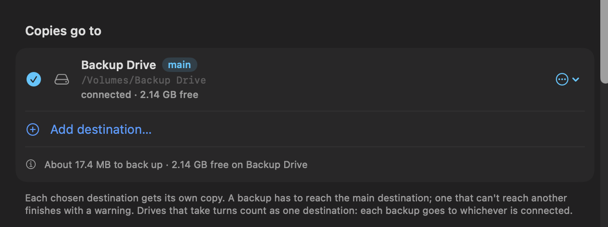

# Formats and destinations

[← Back to contents](README.md)

The format decides what a backup looks like on disk. The destination decides where it goes and how Cryoframe copies it there. The two interact, so they are covered together.

## Formats

In the job editor, "Each backup keeps" offers two choices: one up-to-date copy, or dated versions. One up-to-date copy comes as a disk image (a live mirror) or as plain files. Dated versions come as disk images or zip files.

### One up-to-date copy (live mirror)

A live mirror is a sparsebundle disk image that updates in place. The first run copies the whole library. Every run after that rewrites only the bands that changed, so a nightly mirror of a large library finishes quickly. A mirror keeps one copy, not a history of versions.

Pick it for a frequent working backup of something that changes often, such as an Apple Music library or an active photo library.

A mirror doesn't ask for a size. It sizes itself to the library, grows as the library does, and never grows past what its drive can hold. A run that won't fit beside the drive's reserve is refused before it starts, with a message saying so.

Each run updates a copy of the mirror and swaps it in only when the copy is complete and has been read back against the library. If a run is stopped, fails, or the drive fills partway through, the mirror you had before is still there, whole. Reading the copy back costs some time: in testing, about 17% on a run that changed 2 GB.

A mirror can be paused mid-run. Named pipes, sockets, and device files in a library are left out of the mirror, because they only mean something while a program is running.

The copy isn't the end of a run. After it, the mirror finishes the copy's dates and attributes, writes it out to the drive, reads back everything the run wrote, and removes the previous copy. Each of these steps shows on the job row with its own progress, such as "Reading the copy back: 4.1 GB of 13.7 GB", and Stop works in every one of them. On a first run the read-back reads the whole library back off the drive, so on an SD card or another slow drive it can take many minutes. In 1.6.0 none of these steps showed any progress, and a long read-back looked like a run stuck at "archiving 99%".

### Dated versions (sealed DMG and sealed zip)

A sealed archive is one immutable file written once and never changed: a read-only `.dmg` or a `.zip`. Each run produces a new dated version, so a sealed job builds a history you can restore from. When the destination caps file size, a sealed archive splits into numbered volumes so it still fits. Each version made by 1.6 or later also carries a list of its files, which is what lets [Find a File](restoring.md#find-a-file) search it.

Pick dated versions for cold storage, for a backup you want to keep unchanged, or any time you want to keep more than one point in time. See [Versions, retention, and storage](versions-retention-storage.md).

A sealed DMG cannot be paused while it is being built. A sealed zip can.

Some folders can't go straight into a sealed archive. A folder holding named pipes or sockets is first copied without them, then sealed from the copy. For a disk image, the same applies to append-only items and, on macOS 15, to locked files. The copy needs room in the scratch location (see below) on top of the archive itself, and an encrypted job's copy is always made on the startup disk, so an unencrypted copy of an encrypted job never lands on another drive. Before building a DMG, Cryoframe names anything in the library that would stop the image from being built.

### One up-to-date copy as plain files

Plain files keep one copy of each library as ordinary files and folders, which open anywhere: on a Windows PC, a TV, a camera, or a Mac without Cryoframe. In the job editor, under Keep, choose One up-to-date copy, then Plain files.

<!-- SHOT: editor-plain-files.png — The job editor's Keep section with One up-to-date copy and Plain files chosen, showing the note that plain files aren't encrypted and where deleted items go -->

Plain files are chosen when a job is made, and the job keeps them for good. For a disk image or dated versions, make a new job. Plain files can't be encrypted, and unless every destination is on an encrypted drive the editor says so: anyone with the drive can open them.

A file that changes in the library replaces the one in the copy, so there is no history to go back to. A file you delete from the library isn't deleted from the backup; it moves to Removed items (below).

How a copy is brought up to date depends on the drive. On an APFS drive connected to this Mac (not a cloud folder), each run updates a clone of the copy, reads it back, and swaps it in whole, the way a live mirror does, so the copy is complete at every moment. Everywhere else the copy is updated where it is. While that happens, Cryoframe marks the copy as changing, so a run that is stopped or cut off leaves a copy that Restore and the health check describe as possibly part old and part new. The next backup finishes it.

#### What each drive keeps

| Drive | What a plain copy keeps |
|---|---|
| APFS | Everything: permissions, extended attributes and Finder tags, hidden and locked flags, creation dates, and hard links |
| Mac OS Extended | The same as APFS, with the date limits below |
| exFAT and FAT32 | Names, contents, modification dates, folders, and symbolic links. Permissions, extended attributes and Finder tags, hidden and locked flags, creation dates, and hard links are lost. |
| A network share (SMB) | Treated like exFAT: Cryoframe doesn't count on it keeping anything beyond names, contents, and modification dates |

Restore names what a drive didn't keep when you pick a plain copy on it.

#### App libraries

An app's library (Photos, Apple Music, iMovie, Messages, Mail, Microsoft Outlook, a Final Cut Pro library, a Lightroom Classic or Capture One catalog) can be kept as plain files only on an APFS drive connected to this Mac. The editor won't save such a job for any other destination, and says why:

- exFAT and FAT32 drives can't hold what the app needs to open its library again.
- On a network drive, a copy updated over the network and stopped part way would leave a library the app can't open.
- On a Mac OS Extended drive, the copy is updated where it is, with the same risk.
- A cloud folder uploads the library while it is being updated, and the app can't open a library caught part way.

Use a disk image on those drives. GarageBand, Logic Pro projects, Messages attachments, and folders you add yourself can be kept as plain files anywhere.

Don't open an app library where it sits in a plain copy: its app would change the backup. Restore it first, and open the restored copy.

#### Removed items

What you delete from a library is moved into a folder named Removed items, beside the copy, once the run has read the copy back. Each day gets a folder of its own, such as `Removed items/2026-10-02`, and items keep their path inside it. A name deleted twice on the same day gets "(2)" on the second.

Nothing deletes Removed items on its own. To free the room, open Storage, find the row "*library* · Removed items", and use its Delete… menu: older than 30 days, older than 90 days, older than a year, or all of them. When a run finds too little room on the drive, its message says how much Removed items take. [Find a File](restoring.md#find-a-file) searches Removed items too.

#### Limits of exFAT, FAT32, and network drives

When an item can't be kept on the drive, the run copies everything else, names what it left out, and says why.

- FAT32 can't hold a file of 4 GB or more. Such a file isn't copied. An exFAT or Mac drive can take it.
- A FAT32 folder holds at most 65,536 entries, and a long name uses several of them, so a folder with tens of thousands of files can run out. What doesn't fit isn't copied.
- exFAT and FAT32, and network drives that ignore case, treat names that differ only in capitals or accents as one name. When two library items have such names, only one is copied, always the same one, and the run names the other. Rename one of them to copy both. An item renamed only in its capitals or accents is renamed in the copy, not copied again.
- A network drive may refuse some characters in a name. Each such name is tried on the drive first; one it refuses isn't copied.
- exFAT and FAT32 keep modification dates from 1980 through 2099, and FAT32 keeps them to the nearest two seconds. Mac OS Extended keeps dates from 1904 through 2039. A file dated outside that range is copied with the nearest date the drive keeps, and the run names it.

#### The `._` files on exFAT and FAT32

On exFAT and FAT32, macOS can write a hidden file beside each file, named `._` and then the file's name, to hold details the drive itself can't. A Mac hides these files; Windows, TVs, and cameras show them. Each takes at least one allocation unit on the drive, which is 128 KB on many large SD cards, so a library of many small files can need far more room than its size suggests. Cryoframe checks whether the drive gets these files and counts them when it checks for room.

For the same reason, a library file whose own name starts with `._`, sitting beside a file of the matching name, can't be kept on these drives: macOS would overwrite it. It isn't copied, and the run names it.

### Choosing between them

Use a disk image (a live mirror) when you want fast repeat runs of something that changes often. Use plain files when the copy has to open on any computer, or without Cryoframe. Use dated versions when you want a fixed, verifiable file or a history. A job keeps backups one way, but you can make two jobs for the same library if you want both.

Changing an existing job from one to the other doesn't throw away what it made. Versions already in its folder are shown as "Kept" and nothing deletes them; a mirror left behind by a job that now keeps dated versions is kept the same way.

## Messages attachments

Messages attachments is a library of its own in the job editor: the photos, videos, and files sent and received in Messages (`~/Library/Messages/Attachments`), without the conversations. Messages can stay open while it backs up. It works in every format. A job that backs up Messages already includes its attachments, so the dashboard never names attachments as a gap of their own.

What you delete in Messages stays in the backup:

- A disk image (live mirror) keeps it in a Removed items folder at the top of the image. Restore copies back the attachments alone, and Browse shows Removed items as well. There is no way yet to empty Removed items inside a disk image.
- Plain files keep it in Removed items beside the copy, which you empty in Storage (see [Removed items](#removed-items)).
- Dated versions each hold what the folder held that day, so a deleted file is still in the versions made before you deleted it. Before the Keep rule deletes the last version holding such a file, Cryoframe saves it in a removed-items archive, in the same format and with the same passphrase as the versions. Restore lists these as "Messages attachments, removed items". The Keep rule never deletes them; to remove one, choose Disable schedule in the job's ⋯ menu, since the background agent still runs scheduled jobs while Cryoframe is closed, then quit Cryoframe and delete its folder inside Removed items in Finder. Choose Enable schedule once you're done. If the archive can't be built, or you press Stop, the old versions are kept and the run says so.

Messages also keeps link previews (files ending in `.pluginPayloadAttachment`) and settings files in this folder. Dated versions keep them. A disk image copy and plain files leave them out: they're not anything someone sent you, and a mirror or plain copy can skip them cheaply. A disk image or zip file of dated versions can't skip anything, so leaving them out there would mean copying the whole folder first on every run.

## Destinations

Click Add destination… in the job editor and choose a folder. Cryoframe works out what kind of place it is from the drive it's on, so you don't have to say:

- a folder on this Mac's startup disk,
- a folder on an external drive,
- a folder on a network share,
- or a cloud-sync folder, which can also be picked from the Cloud folders menu.

A destination is known by its drive's volume UUID as well as its path. A drive that's been renamed, or mounts as "T7 1" because another drive took its name, is still found. A different drive that happens to have the same name isn't used by mistake.

Every destination gets a plain-text note at its top, "READ ME - How to restore without Cryoframe.txt", saying what's in that folder and how to open each backup with tools built into macOS. It is rewritten after each run from what the folder actually holds, and has no passphrases or paths outside the folder in it.

### This Mac

The backup is written straight to the destination. This is the simplest case and the fastest.

### Network share or external drive

A long copy to a share or a bus-powered drive can be cut off by a dropped connection or an unplugged cable, so Cryoframe makes these transfers resumable. This matters most for sealed archives, which are large single files.

How it works:

- The archive is built locally first, in a scratch location, then shipped to the destination in numbered parts. The default part size is 2 GB, set in Settings ▸ Transfers.
- If the link drops, the next run (or the next time the drive reconnects) continues from the last whole part instead of starting over. There is no new snapshot and no rebuild. An interrupted transfer only resumes on the drive it started on, and a transfer counts as complete only once every part has been checked.
- Building locally needs scratch space of about one archive. The scratch location is in Settings ▸ Transfers and defaults to your system cache.
- A sealed archive lands as parts named `Library.dmg.part.000`, `.001`, and so on. To use it by hand, join the parts first: `cat Library.dmg.part.* > Library.dmg`. The Restore window does this for you.

A live mirror to a share resumes differently: there are no parts, so an interrupted mirror just continues on the next run.

### The scratch location

If you choose your own scratch location, Cryoframe works only inside a folder of its own there, named Cryoframe Scratch, and removes only what it marked as its own.

Before 1.6, Cryoframe deleted any `<folder>/build/<item>` in the scratch location each time it launched. In the default location that was harmless, but a scratch location that held other things, such as `~/Developer`, lost other projects' build output. If you ever changed the scratch location, check that folder. Leftovers from 1.5 in a custom location are listed in Settings ▸ Transfers rather than deleted.

### Cloud-sync folder

The backup is written into a folder managed by a sync client (OneDrive, Dropbox, Google Drive, Box, or iCloud Drive), and the client uploads it on its own schedule. Cryoframe does not manage the upload, so a dropped connection is the sync client's job to resume.

When you add a cloud-sync destination, Cryoframe detects which provider the folder belongs to (it looks under `~/Library/CloudStorage`) and asks which plan you're on, so it can split sealed archives under that plan's single-file limit. Those limits differ a lot: **iCloud Drive caps at 50 GB**, **Box at 5 GB** on Free/Starter (50 GB on Business, 150 GB on Enterprise), and the rest around 250 GB. Pick the plan that matches your account (too high and the provider rejects an oversized part) or enter a custom size.

These clients offload files to save local space (Dropbox Smart Sync, OneDrive Files On-Demand, Google Drive streaming). After your archive uploads, its local copy may be replaced with a placeholder. Reading it then downloads it again. So:

- A scheduled health check skips an offloaded cloud archive rather than silently pulling it back down, and notes it as "not downloaded." Turn on Settings ▸ General ▸ Archive health ▸ "Download cloud archives to check them" to verify them anyway.
- A restore from a cloud folder downloads whatever it needs before opening it, which is expected: you are getting the data back.

Storage shows, for each cloud destination, whether its versions have been uploaded. See [Versions, retention, and storage](versions-retention-storage.md#cloud-upload-status). Until a provider proves it, the answer is "Upload not known", in gray, and that is normal.

A cloud-sync folder is a fine *second* copy for off-site reach. For the main destination, a local or network destination that keeps a full local copy is faster to verify and restore.

## Drives that take turns

Rotating backup drives (one at home, one away, swapped every so often) is a good way to keep a copy off-site. In the job editor, add each drive as a destination, then open one drive's menu and choose Takes turns with and the other drive. The pair counts as one destination: each backup goes to whichever drive is connected, and the one that's away is shown as "away" rather than as a problem. Stop taking turns splits them again.

### Two drives with the same name, from 1.5

Before 1.6, the only way to take turns was to give two drives the same name. 1.6 knows drives by their identity, so it sees two different drives. When the other one is connected, the job editor shows Is this one of your drives?… on that destination, and you can choose:

- Take turns under one name: both drives keep the name, and the job uses whichever is connected.
- Rename this drive…: the connected drive gets a name of its own, and a new destination on it takes turns with the original. Renaming changes only the drive's name, not what's on it. Before you rename, the editor shows what the next backup to that drive will do there. Apps or scripts that find the drive by its path may lose it, since the path changes with the name.

## A note on free space

Before a run, Cryoframe checks that the destination has room and stops with a clear message if it does not, rather than failing partway through. On a network share or a non-APFS volume, macOS sometimes does not report free space at all. In that case Cryoframe lets the run proceed rather than block a backup it cannot measure, so the copy itself reports a full disk if one ever occurs.
