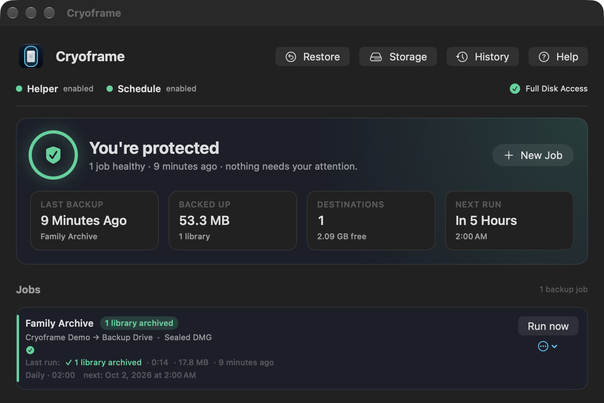

# Getting started

[← Back to contents](README.md)

Three one-time steps stand between a fresh install and a working backup. The main window shows their status across the top, with a colored dot for each.

## 1. Enable the helper

Cryoframe takes snapshots through a small background service that runs with elevated rights. The app cannot take a snapshot itself, so this service has to be installed once.

Click the helper status at the top of the window and approve the prompt. macOS then asks you to allow the login item in System Settings ▸ General ▸ Login Items. Turn it on. The dot turns green when the helper is registered and answering.

If the dot stays gray after you approve it, quit and reopen Cryoframe. The helper registers on launch.

## 2. Grant Full Disk Access

Photos, Apple Music, Messages, and several other libraries live in protected locations. macOS hides them from apps until you grant Full Disk Access, and that includes Cryoframe.

Open System Settings ▸ Privacy & Security ▸ Full Disk Access, turn Cryoframe on, and relaunch the app. The Full Disk Access marker in the top right turns green once the app can read protected libraries. On a macOS where Cryoframe can't confirm the grant, it shows a gray question mark instead; that isn't a fault, and a backup that can't read a library says so when it runs. The background helper rides on the same grant, so you only do this once.

Without Full Disk Access, a job that targets a protected library fails with a read error. Folders you own outside the protected set still work.

## 3. Enable the schedule (optional)

If you want jobs to run on their own, turn on the schedule. This installs a launchd agent that wakes about once an hour and runs any job that is due. Jobs only run while you are logged in.

You can skip this and run every job by hand with Run now. Scheduling is only needed for unattended backups.

## Make your first job

Click New Job to open the job editor. You can also drag a folder onto the window to start one with that folder already in it.

<!-- SHOT: editor-create.png — the job editor in create mode with quick-start presets -->

**Quick start.** A new job begins with presets: "Photos, nightly", "Music, kept up to date", "Photos and Music", or start from scratch. A preset fills in everything below it, and you can change any of it.

**Back up.** The libraries and folders in the job. Each library shows its size once measured. Add a folder with Back up another folder…, or a Final Cut Pro, Lightroom, Capture One, or Logic Pro library with A library from another app….

**Copies go to.** Add destination… and choose a folder: on this Mac, on an external drive, on a network share, or in a cloud folder. Cryoframe works out which kind it is. The first destination is the main one, which every backup has to reach; the rest are extra copies. If the backup may not fit on the main destination, the editor says so before you create the job.

**When.** Every day, every few hours, once, or only when you say.

**Keep.** Whether each backup keeps one up-to-date copy or dated versions, and for dated versions, their format and how many to keep.

**Details.** Encryption, how each backup is checked, and what to do if the library's app is open. The defaults are set for a trustworthy backup.

Before the job is created, a summary says what its first backup will do, including anything it would delete at a destination that already holds backups. Then click Run now once to confirm it works end to end. The job row turns green when the backup is written and checked. You do not need to quit Photos or Music first.

## The dashboard

Once you have a job, the top of the window is a status panel that answers "am I backed up?" at a glance: a green shield when everything is healthy, or an amber warning naming the job that needs attention. Below it are four figures: the last successful backup, the total size protected, the number of destinations, and free space on the tightest one.

A few cards can appear under it when something needs a decision from you: backups from an earlier version of Cryoframe that a job is keeping until you say otherwise (see [Versions, retention, and storage](versions-retention-storage.md)), and a reminder when your recovery file or printed recovery kit is out of date (see [Encryption and recovery keys](encryption-and-recovery-keys.md)).

<!-- SHOT: main-window.png — the main window: protection dashboard, a decision card, and the job list -->

## What to read next

- [Jobs](jobs.md) for running, pausing, and managing backups.
- [Encryption and recovery keys](encryption-and-recovery-keys.md) if any backup leaves your Mac, for example to a NAS or a cloud folder.
- [Restoring](restoring.md) for getting a library, or a single file, back.
