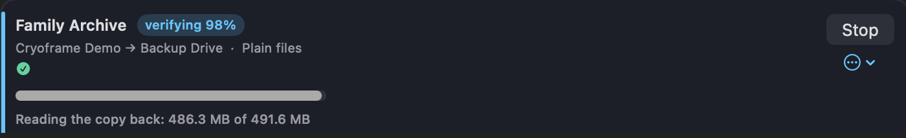
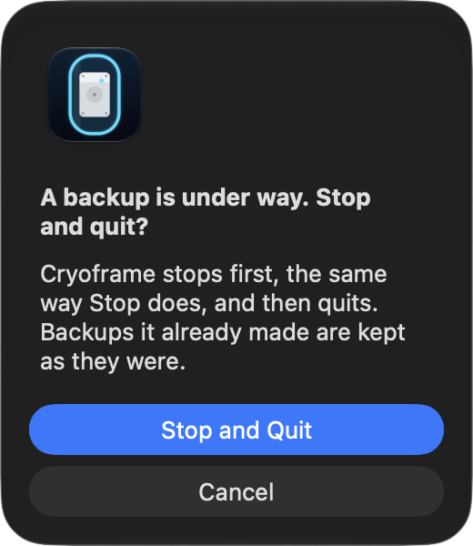

# Jobs

[← Back to contents](README.md)

A job is one backup definition: which libraries and folders to back up, where the copies go, how each backup is kept, and how often it runs. The main window lists your jobs, each with its last result and next run time.

## The job editor

New Job and Edit… open the same editor, so making a job and changing one look the same and use the same words. It has up to six parts: Quick start (new jobs only), Back up, Copies go to, When, Keep, and Details.

**Back up** lists the libraries and folders in the job. Everything chosen is backed up from one moment in time, each into a folder of its own at every destination, so the set is consistent to the same instant. A job can hold one library or a dozen. Add a folder with Back up another folder…, or a library another app keeps anywhere it likes with A library from another app… (Final Cut Pro, Lightroom Classic, Capture One, Logic Pro). Two libraries with the same name can be in one job; the editor notes it, and each gets its own folder.

Each library's menu has:

- Rename…, which changes the library's name in this job. Its backup folders are renamed at the next backup that reaches each destination. A folder on a drive that's away keeps the old name until then and is still found by it.
- Show in Finder.
- Choose where it's kept…, for a built-in library such as Photos that isn't at its default location (on an external SSD, say). A library that isn't where it should be reads "not found there". Repointing keeps the library's identity, so Photos still knows to watch for the Photos app and still gets its database check.
- Remove.

**Copies go to** lists the destinations. See [Formats and destinations](formats-and-destinations.md) for what each kind does. The first destination is the main one: a backup has to reach it, while one that can't reach another finishes with a warning. Make main moves that role to another destination, and drives can take turns as one destination.

**When** sets how often the job runs: every day, every few hours, once, or only when you say.

**Keep** sets whether each backup keeps one up-to-date copy or dated versions. One up-to-date copy is kept as a disk image or as plain files; dated versions as disk images or zip files, with how many to keep. Plain files can only be chosen for a new job. See [Formats and destinations](formats-and-destinations.md).

**Details** holds encryption, how each backup is checked (a quick check, or a full check that opens it), and what to do if the library's app is open: back up anyway, back up and say so, or wait until it's closed.

Defaults for new jobs live in Settings ▸ General, so if you always want the same format or check, set it once there.

A library on another drive is backed up from a snapshot of that drive when it is APFS, the same way as the startup disk. exFAT and HFS+ drives can't be snapshotted, so Cryoframe reads them directly and won't start while the owning app is open.

## What saving does

Before a change is saved, and before a new job's first backup, the editor shows a summary of what it does to the backups already at each destination, such as a folder the job takes over or versions its Keep rule would delete.

Backups an earlier version of Cryoframe made, or versions moved into a job's folder, are never deleted by the Keep rule until you give the go-ahead; see [Versions, retention, and storage](versions-retention-storage.md).

## Running a job

Run now starts a job immediately, whether or not it has a schedule. While it runs, the row shows live progress: the current library, bytes written, speed, time elapsed, and an estimate of time remaining.

A live mirror has more to do after the copy, and the row names each step as it goes, with a count of items or bytes: Finishing the copy, Writing the copy to the drive, Reading the copy back, Checking attributes, Removing the previous copy. A plain-files copy shows its steps the same way. Copying what changed shows how long it has been going but no count, because the copy tool can't report one while it compares the library with the copy. On a first run, reading the copy back means reading the whole library back off the drive, which can take many minutes on a slow drive or SD card.

You can run several jobs at once. The limit is in Settings ▸ General and defaults to 2. Snapshot creation is serialized inside the helper, so even with jobs running in parallel each one captures a clean point-in-time set. A job never runs twice at once, whether the run was started from the window or by the schedule, and the window shows and can stop a run the schedule started.

## Pause, resume, and stop

Pause suspends the running tool in place and holds the snapshot, then Resume picks up where it left off. Pause is offered for live mirrors, sealed zips, and transfers to a drive or share. It is not offered while a sealed DMG is being built, because the macOS disk-image tool crashes if it is frozen mid-write, so a DMG job shows only Stop during that stage.

Stop cancels a running or queued job and tears the snapshot down. It also works in each step after a mirror's or plain-files copy. A copy that was stopped before it was fully read back is removed at the start of the next run. A sealed archive cannot resume mid-build, so a stopped sealed job starts over next time. An interrupted transfer to a network share or external drive is the exception: it resumes from its last whole part when the same drive reconnects. Stop never interrupts a disk image while macOS is attaching it; the attach finishes, and Cryoframe then detaches it.

A tool that makes no progress for 15 minutes is stopped, and the run says so.

## Quitting while something runs

If you quit Cryoframe while it is backing up, checking backups, exporting, or restoring, it asks first, for example "A backup is under way. Stop and quit?" Stop and Quit stops everything the way Stop does, then quits once it has all ended; backups it already made stay as they were. A restore can't be stopped part way, so Cryoframe waits for it to finish; when a restore is all that's running, the choice is Quit When Done.

If you quit again while things are stopping, Cryoframe offers Keep Waiting or Quit Now. Quit Now can leave a mirror's disk image attached until that job's next backup. If something still hasn't stopped after a minute, Cryoframe quits anyway and notes it in the activity log; a restore is always waited for.

A logout, restart, or shutdown doesn't wait on a question, since nobody may be there to answer it. Cryoframe stops everything, waits up to 15 seconds for it to stop, and then lets the logout go ahead. A restore can't be stopped, so one still running then is cut off; let a restore finish before you log out.

A backup the schedule started runs in a background process of its own, so quitting the app neither asks about it nor stops it.

## The ⋯ menu

Each job's ⋯ menu holds:

- Edit…, to change any setting.
- Verify archives, Run restore drill…, and Rehearse recovery…. See [Health and verification](health-and-verification.md).
- Copy passphrase, shown only for an encrypted job that has a saved passphrase. See [Encryption and recovery keys](encryption-and-recovery-keys.md).
- Disable schedule or Enable schedule. A disabled job has no next-run time and never runs on its own, but Run now still works.
- Delete…, which removes the job.

Deleting a job keeps everything it made. The confirmation lists the folders it wrote at each destination, and they all stay; Restore still finds them. An encrypted job's passphrase stays in your Keychain too, and Restore offers it for those backups. A job can't be deleted while it is running or being checked.

## Library status

Each job shows a green check when its libraries are found, or a red mark when one is missing, with a link to fix a built-in library's location in Settings. A library can go missing if you move it, rename it, or unplug the drive it lives on.

## Run history

Every run is recorded with its outcome, per-library detail, duration, size, and any error, and the record survives quitting the app. Each job row shows its last run at a glance. The History button at the top of the window lists every past run, including scheduled ones that happened while the app was closed.

The Activity list on the main window narrates runs as they happen. Clear, at its top right, empties it after you confirm. It only hides entries. History still has every run, and the dashboard and alerts still use them. Lines for runs still going stay in the list, and cleared entries don't come back when you reopen Cryoframe.

If a job failed, History is the first place to look. The recorded error is the real reason the run stopped, which is usually more specific than the one-line summary on the job row.
