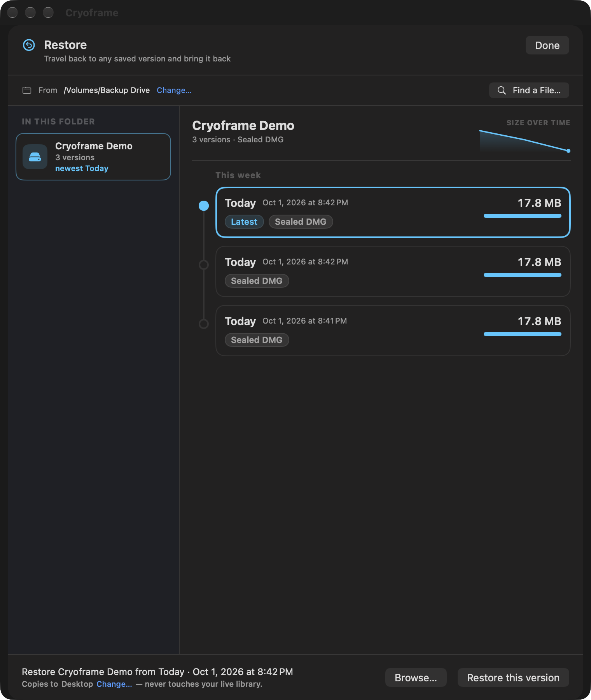
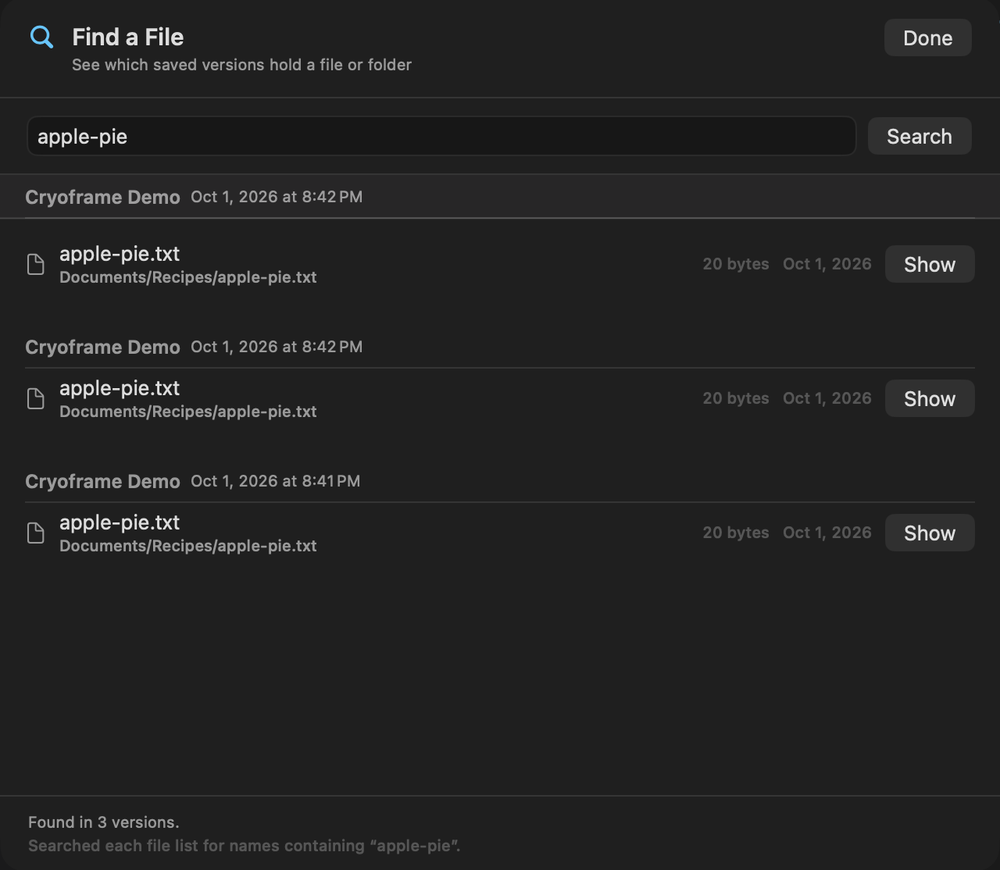
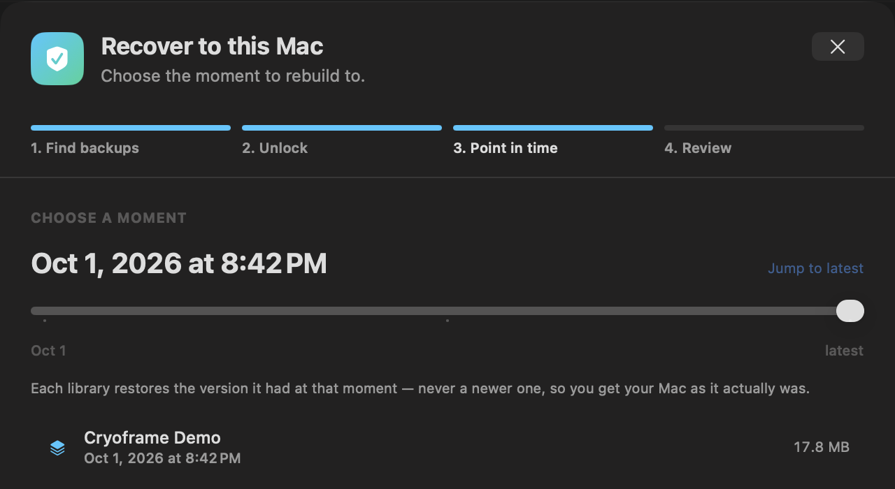
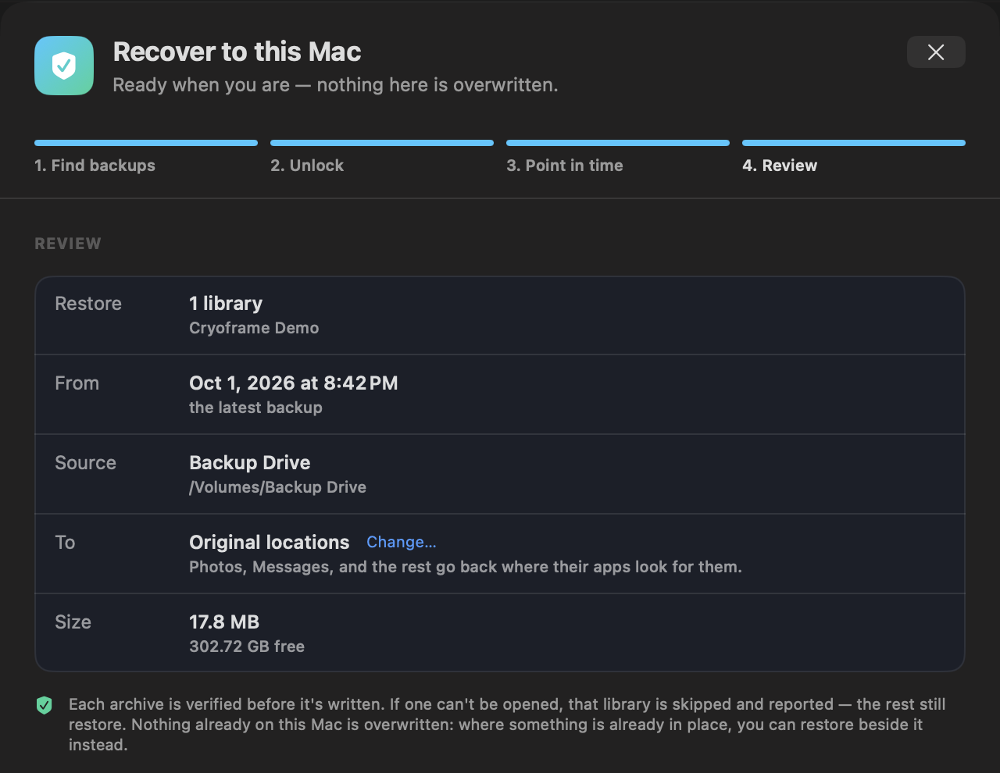

# Restoring

[← Back to contents](README.md)

Restoring reads a library back out of an archive. There are two doors, depending on what happened.

**Restore** (⌘R, or the Restore button) is for getting one library back: copy it out beside your live one, replace the live one in place, find which version holds a file, pull a few files out of a version, or export its photos and videos into month folders. **Recover to this Mac** (⇧⌘R) is for a new or wiped Mac, where you want everything back at once. It is covered at the end of this page.

If you don't have Cryoframe at hand, every destination has a note at its top, "READ ME - How to restore without Cryoframe.txt", that explains how to open each backup with tools built into macOS.

Everything here verifies an archive's checksums before writing anything, checks there is room first, and never overwrites what is already on the Mac unless you switch the restore to In place, which moves your current library to the Trash first. An archive in a cloud folder that the provider has offloaded is downloaded before it is opened.

## Find the archives

Point Restore at the folder that holds your archives, or use a Quick pick for a destination you back up to. Cryoframe lists the libraries it finds down the left side, each with how many versions it has and when the newest one was made. A lock marks an encrypted library; enter its passphrase once and it applies to every version.

Messages attachments kept as dated versions can also have removed-items archives, which hold files deleted in Messages before the Keep rule deleted the last version holding them. Restore lists them as "Messages attachments, removed items". You can restore one beside your library or browse it, but not restore it in place. Recover to this Mac leaves them out. See [Messages attachments](formats-and-destinations.md#messages-attachments).

## The timeline

Choose a library and its versions appear as a timeline, newest first, grouped into this week and earlier. Each version shows the day, the exact date and time, its size, and a bar comparing it with the other versions, so a night where a library suddenly grew or shrank is easy to spot.

Some versions carry a badge:

- **Restore-tested** means a restore drill reassembled that version, opened it, and reopened the library inside. The restore path itself is proven.
- **Checksum verified** means its checksums were re-read and matched. That confirms the bytes are intact, which is a weaker promise than proving it opens.
- **No badge** means nothing has checked that version yet. It is not a sign of trouble; it just means Cryoframe will not claim more than it knows. See [Health and verification](health-and-verification.md) to check them.
- **Kept** means the version is from before its job changed how it keeps backups. Nothing deletes it; see [Versions, retention, and storage](versions-retention-storage.md#kept-versions).

A live mirror or a plain-files copy has no timeline. It keeps one copy, brought up to date by each run, so there is a single state to restore: the current one. Cryoframe says so rather than showing a history that does not exist. If you want a history for that library, keep dated versions with a Keep rule; see [Versions, retention, and storage](versions-retention-storage.md).

Select a version and the bar at the bottom names exactly what will happen when you restore it.

If an archive is encrypted, enter its passphrase. If the passphrase is still in this Mac's Keychain it is filled in for you. If not, get it from your recovery file. See [Encryption and recovery keys](encryption-and-recovery-keys.md).

## Copy a library out (the safe default)

Pick what to restore and a destination folder, then click Restore. Cryoframe verifies the checksums, mounts or extracts the archive, joins any split parts, and copies the library out with its original folder name.

The copy lands next to anything already in the destination. It never writes over your live library. If something there already has the library's name, the restore stops and says so, and Restore Alongside keeps what's there and brings the library back beside it under a new name, such as "Photos Library (2)". When it is done, move the restored library into place yourself, or double-click it to open in its app. This is the option to use when you are not certain, because it changes nothing you did not ask it to.

## Plain-files copies

A plain-files copy is already ordinary files, so for a folder, Show in Finder takes you straight to it and you can copy what you need yourself. Restore still works for it the same way as for any other backup. In the list of libraries it reads "Plain files" and "current copy".

Its Removed items aren't a version you restore. They are ordinary folders beside the copy, one for each day, so Restore doesn't list them: Show Removed Items in Finder opens them, and [Find a File](#find-a-file) searches them.

Restore adds a note when a plain copy needs one. It names what the drive didn't keep, such as permissions or creation dates on an exFAT drive. It warns when the copy's last update was stopped before it finished, so some files may be from the update before. For an app library kept as a package, such as Photos, it has no Show in Finder: restore the library and open the restored copy, because the app would change the backup if you opened it where it sits.

## Restore in place

Switch the restore bar from Beside to In place, and the version you picked goes back exactly where the live library is. This is for the case where the live library is damaged or gone and you want the archived copy to take over.

It is built to be safe. Cryoframe restores and verifies the archive into a staging copy first, and only once that copy is good does it move your current library to the Trash and swap the restored copy into place. If anything goes wrong before the swap, your live library is untouched. After the swap, the previous library is in the Trash, so the change is reversible.

If a restore is cut off part way, by a crash, Force Quit, a logout or a restart, Cryoframe deals with it the next time it opens and shows an alert saying what it did and where everything is. It never deletes a verified copy or your library:

- If your library had already gone to the Trash, the verified copy is moved into its place.
- If something is in the library's place, whether your own library because the restore stopped before the Trash or a new library made since, it is left as it is. The verified copy is put beside it under a name that shows, such as "Photos Library (2)". Show in Finder in the alert takes you to it.
- A copy left by a restore in Cryoframe 1.6 is put beside the library the same way. 1.6 didn't record whether its copy was complete, so check it before you use it.

A restore that is cut off before its copy is complete, in place or beside, leaves only a hidden folder, never half a library under the library's own name. The next restore into that folder removes it.

Quit the app that owns the library first. Cryoframe checks for this and tells you if, for example, Photos is still running.

## Browse and extract a few files

Sometimes you do not want the whole library back, just a handful of files from inside it. Browse, on the restore bar, opens the selected version in an in-app file browser. You drill into folders, select the items you want, and extract just those to a folder you choose. The archive is mounted read-only while you browse and is unmounted when you close the browser.

A library package, like a `.photoslibrary`, shows as a single item you extract whole rather than a folder you walk into, because the package is meant to be handled as a unit.

## Export media

Export Media…, on the restore bar, copies the photos, videos, or other files in a version out as ordinary files, sorted into a folder for each month. It's a one-time copy: nothing keeps the exported folder up to date.

<!-- SHOT: export-media.png — The Export Media sheet for a Messages attachments version: Photos and Videos chosen, the month filter, the folder to copy into, and the warning that exported files aren't encrypted -->

Choose what to copy: Photos (each Live Photo's video goes with its photo), Videos, and Other files. Turn on "Only files from some months" to pick a range. Then choose a folder and click Export.

- Each file goes into a folder named for the month it was last changed, such as `2024-05`. The month comes from the modification date because every drive keeps that one; exFAT and FAT32 lose creation dates.
- Exporting again copies only what isn't there yet. A file whose name is already taken is compared with what's there: the same file is skipped, and a different one is saved as "IMG_0001 (2).HEIC". The same file gets the same name every time, so you can stop an export and run it again.
- A file that can't be read from the backup is skipped, and the summary names it; the rest still go out. Another version may still have it. A file that can't be saved in the folder ends the export, and exporting again skips what was already copied.
- Cryoframe checks for room before it copies anything. On a FAT32 drive, a file of 4 GB or more is skipped and named.
- Hidden files, settings files, and the link previews Messages keeps aren't exported.

The exported files aren't encrypted. When the version is encrypted, or holds Messages photos and files, the sheet says so before you export, unless the folder is on an encrypted drive. For Messages that includes files deleted in Messages since the backup was made. Delete the exported files in Finder when you're done with them.

Export Media is offered for folders, Messages, and Messages attachments. It isn't offered for app libraries such as Photos, Apple Music, iMovie, GarageBand, Mail, Microsoft Outlook, or a Final Cut Pro library: their files are the app's own, and Photos, for one, keeps thumbnails and edits beside each original. To get files out of those, restore the library and export from its app.

## Find a File

When you know the file you want but not which night still had it, click Find a File… at the top of the Restore window. Type a name, such as "Taxes 2024.pdf", or part of a path, such as "Documents/Taxes". You can also paste a whole path: one copied from Finder, dragged into Terminal, or in quotes. Upper and lower case don't matter, and an accented name matches however it was written.

Cryoframe searches the list of files saved with each version, newest first, and shows what matched in each, with Stop if you've seen enough. Show opens that version in the file browser at the match, so you can extract it. Encrypted versions use the passphrase you type, and the one saved on this Mac for that job is tried too.

Not every version can answer:

- A version made before 1.6 has no file list, and neither does a live mirror. The search says so and offers Look inside…, which opens the version so you can browse it yourself.
- A plain-files copy has a list, and the search looks through its Removed items as well. A match there reads "Removed from the library on" and the day it went.
- A list that's missing, damaged, or locked with a passphrase that doesn't open it is treated the same way: no list, rather than "not found".
- A list that was cut short (a very large library, or one read while it was changing) shows what it has, but never says a file isn't there.

Only a complete list that checks out says "Not in this version", so a miss there means the file really wasn't in that backup.

## Recovering a whole Mac

If the Mac is new, or you have wiped this one, you are not looking for one library. You want everything back the way it was. **Recover to this Mac** (⇧⌘R, the File menu, or the link on the empty main window) walks four steps.

**1. Find backups.** Point it at the drive, NAS, or cloud folder your archives were written to. It reports what it found: how many libraries, how many points in time, and how many are encrypted.

**2. Unlock.** Encrypted libraries need their passphrases, and on a new Mac they are not in the Keychain yet. Open the recovery file you exported and enter its master password, and every passphrase comes back at once. Without it you can still restore whatever is not encrypted; the locked libraries are named and skipped rather than failing the whole run. See [Encryption and recovery keys](encryption-and-recovery-keys.md).

**3. Point in time.** One slider chooses the moment to rebuild to, and each library shows the version it will contribute.

This is the part worth understanding. Libraries rarely run on the same nights: Photos might back up nightly while a project folder runs weekly. When you choose a moment, each library contributes the newest version it had **at or before** that moment, never a later one. Pick Wednesday and a library whose last run was Monday gives you its Monday version, because that is what existed on Wednesday. Its Friday version holds changes that had not happened yet, so using it would rebuild a Mac that never existed. If a library is newer than the moment you chose and has nothing that old, it gives you its earliest version and says so.

**4. Review.** Check what is about to happen. By default each library goes back to where its app looks for it, so Photos and Messages simply open what came back; use Change to put everything in one folder instead. Nothing already on this Mac is overwritten, each archive is verified before it is written, and a library that cannot be opened is skipped and reported while the rest still restore. If something is already where a library would go, you can restore that library, or all of them, alongside it.

## Split archives

A sealed archive sent to a network share or external drive arrives as numbered parts. Restore reassembles them for you, so you never need to join parts by hand. If you want to use the parts outside Cryoframe, join them first with `cat Library.dmg.part.* > Library.dmg` and then mount the result.
